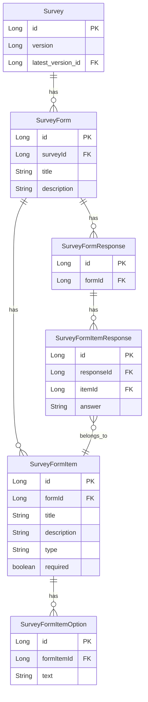

# 프로젝트 설계

## DB 설계

설문조사를 생성하면 설문조사 ID와 Form, FormItem, FormItemOption 정보가 생성된다.  
설문조사를 수정하는 경우 설문조사 ID의 버전이 바뀌며, Form, FormItem, FormItemOtpion 정보가 새로 생성된다.  
설문조사 응답으로는 Form의 id를 가진 Form 응답 정보와 FormItem의 id를 가진 FormItem 응답 정보가 생성된다.  


<br/>

## API 설계

### API 엔드포인트

 - 설문조사 생성 API
    - HTTP Method: POST
    - URL: /api/survey
 - 설문조사 수정 API
    - HTTP Method: PUT
    - URL: /api/survey/:surveyId
 - 설문조사 응답 제출 API
    - HTTP Method: POST
    - URL: /api/survey/:surveyId/answer
 - 설문조사 응답 조회 API
    - HTTP Method: GET
    - URL: /api/survey/:surveyId/answer

<br/>

### API 요청 Body

```json
// 설문조사 양식 생성 Request
// POST http://localhost:8080/api/survey
// Content-Type: application/json

{
  "title": "양식 제목",
  "description": "양식 설명",
  "items": [
    {
      "title": "항목 제목",
      "description": "항목 설명",
      "type": "SHORT_TEXT",
      "required": true
    },
    {
      "title": "항목 제목2",
      "description": "항목 설명2",
      "type": "SHORT_TEXT",
      "required": true
    },
    {
      "title": "항목 제목3",
      "description": "항목 설명3",
      "type": "SINGLE_CHOICE",
      "required": true,
      "options": [
        {
          "text": "hello"
        },
        {
          "text": "bye"
        }
      ]
    }
  ]
}

// 설문조사 양식 수정 Request
// PUT http://localhost:8080/api/survey/1
// Content-Type: application/json

{
  "title": "양식 제목11",
  "description": "양식 설명11",
  "items": [
    {
      "title": "항목 제목11",
      "description": "항목 설명11",
      "type": "SHORT_TEXT",
      "required": true
    },
    {
      "title": "항목 제목22",
      "description": "항목 설명22",
      "type": "SHORT_TEXT",
      "required": true
    },
    {
      "title": "항목 제목33",
      "description": "항목 설명33",
      "type": "SINGLE_CHOICE",
      "required": true,
      "options": [
        {
          "text": "aa"
        },
        {
          "text": "bb"
        }
      ]
    }
  ]
}

// 설문조사 응답 제출 Request
// POST http://localhost:8080/api/survey/1/response/submit
// Content-Type: application/json

{
  "formId": 1,
  "items": [
    {
      "itemId": 1,
      "answer": "텍스트"
    },
    {
      "itemId": 2,
      "answer": "멀티플 텍스트"
    },
    {
      "itemId": 3,
      "answer": "1" // 단일 선택 리스트
    },
    {
      "itemId": 4,
      "answer": "3,4" // 다중 선택 리스트
    }
  ]
}

```
